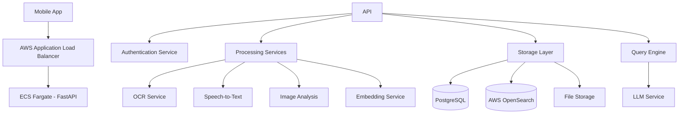

# ChronoTrail API Design Document

## Overview

ChronoTrail is a Python-based REST API service that enables users to store, process, and query personal timeline data through natural language. The system employs a hybrid storage approach combining relational and vector databases to handle structured location data and unstructured content for semantic search capabilities.

## Architecture

### High-Level Architecture



### Technology Stack

- **API Framework**: FastAPI (Python) - for high-performance async REST API
- **Relational Database**: Amazon Aurora PostgreSQL - for structured location and metadata storage
- **Vector Database**: AWS OpenSearch - for semantic search and embeddings
- **File Storage**: AWS S3 - for scalable, durable media file storage
- **Authentication**: AWS Cognito User Pools with Google/Apple OAuth integration
- **Usage Management**: Tier-based rate limiting and data retention policies
- **OCR**: Amazon Textract - for text extraction from images
- **Speech-to-Text**: Amazon Transcribe - for voice note transcription
- **Image Analysis**: Amazon Rekognition - for image content analysis
- **Embeddings**: Amazon Bedrock (Titan Embeddings) - for text embeddings
- **LLM**: Amazon Bedrock (Claude 3 or Llama) - for natural language processing

## Components and Interfaces

### API Endpoints

#### Authentication
- `GET /api/v1/auth/me` - Get current user profile
- `POST /api/v1/auth/refresh` - Refresh Cognito token

#### Location Visits
- `POST /api/v1/locations` - Create location visit
- `GET /api/v1/locations` - Retrieve location visits with date filtering
- `PUT /api/v1/locations/{visit_id}` - Update location visit

#### Content Submission
- `POST /api/v1/notes` - Submit text notes
- `POST /api/v1/photos` - Upload photos
- `POST /api/v1/voice` - Upload voice recordings

#### Querying
- `POST /api/v1/query` - Natural language query
- `GET /api/v1/media/{media_id}` - Retrieve media files

#### Usage & Subscription
- `GET /api/v1/usage` - Get current usage statistics
- `GET /api/v1/subscription` - Get subscription details

### Core Services

#### Authentication Service
```python
class AuthService:
    def validate_cognito_token(self, access_token: str) -> CognitoUser
    def get_user_from_cognito(self, cognito_sub: str) -> User
    def create_or_update_user_from_cognito(self, cognito_user: CognitoUser) -> User
    def get_current_user(self, access_token: str) -> User
    def ensure_user_access(self, user_id: str, resource_user_id: str) -> bool

class UsageService:
    def check_daily_limits(self, user: User, action_type: str) -> bool
    def increment_usage(self, user_id: UUID, action_type: str) -> None
    def get_usage_stats(self, user_id: UUID) -> UsageStats
    def can_query_date_range(self, user: User, start_date: datetime) -> bool
    def get_subscription_info(self, user_id: UUID) -> SubscriptionInfo
```

#### Processing Service
```python
class ProcessingService:
    def process_photo(self, file: UploadFile) -> ProcessedPhoto
    def process_voice(self, file: UploadFile) -> ProcessedVoice
    def generate_embeddings(self, text: str) -> List[float]
    def extract_text_from_image(self, image_data: bytes) -> str
    def describe_image(self, image_data: bytes) -> str
    def transcribe_audio(self, audio_data: bytes) -> str
```

#### Storage Service
```python
class StorageService:
    def store_location_visit(self, visit: LocationVisit) -> str
    def store_text_content(self, content: TextContent) -> str
    def store_media_file(self, file: UploadFile, user_id: str) -> str
    def update_location_visit(self, visit_id: str, updates: dict) -> LocationVisit
    def get_location_visits(self, user_id: str, date_range: DateRange) -> List[LocationVisit]
```

#### Query Service
```python
class QueryService:
    def process_natural_language_query(self, user_id: str, query: str) -> QueryResponse
    def search_vector_content(self, user_id: str, query_embedding: List[float]) -> List[SearchResult]
    def search_structured_data(self, user_id: str, filters: dict) -> List[StructuredResult]
    def generate_response(self, context: List[SearchResult], query: str) -> str
```

## Data Models

### Relational Database Schema (PostgreSQL)

#### Users Table
```sql
CREATE TABLE users (
    id UUID PRIMARY KEY DEFAULT gen_random_uuid(),
    email VARCHAR(255) UNIQUE NOT NULL,
    oauth_provider VARCHAR(50) NOT NULL, -- 'google', 'apple'
    oauth_subject VARCHAR(255) NOT NULL, -- Provider's user ID
    display_name VARCHAR(255),
    profile_picture_url TEXT,
    subscription_tier VARCHAR(50) DEFAULT 'free', -- 'free', 'premium', 'pro'
    subscription_expires_at TIMESTAMP,
    created_at TIMESTAMP DEFAULT CURRENT_TIMESTAMP,
    updated_at TIMESTAMP DEFAULT CURRENT_TIMESTAMP,
    UNIQUE(oauth_provider, oauth_subject)
);

CREATE INDEX idx_users_oauth ON users(oauth_provider, oauth_subject);
CREATE INDEX idx_users_subscription ON users(subscription_tier, subscription_expires_at);
```

#### Usage Tracking Table
```sql
CREATE TABLE daily_usage (
    id UUID PRIMARY KEY DEFAULT gen_random_uuid(),
    user_id UUID REFERENCES users(id) ON DELETE CASCADE,
    usage_date DATE NOT NULL,
    text_notes_count INTEGER DEFAULT 0,
    media_files_count INTEGER DEFAULT 0,
    queries_count INTEGER DEFAULT 0,
    created_at TIMESTAMP DEFAULT CURRENT_TIMESTAMP,
    updated_at TIMESTAMP DEFAULT CURRENT_TIMESTAMP,
    UNIQUE(user_id, usage_date)
);

CREATE INDEX idx_daily_usage_user_date ON daily_usage(user_id, usage_date);
```

#### Location Visits Table
```sql
CREATE TABLE location_visits (
    id UUID PRIMARY KEY DEFAULT gen_random_uuid(),
    user_id UUID REFERENCES users(id) ON DELETE CASCADE,
    longitude DECIMAL(10, 8) NOT NULL,
    latitude DECIMAL(11, 8) NOT NULL,
    address TEXT,
    names TEXT[], -- Array of names/tags for the location
    visit_time TIMESTAMP NOT NULL,
    duration INTEGER, -- in minutes
    description TEXT,
    created_at TIMESTAMP DEFAULT CURRENT_TIMESTAMP,
    updated_at TIMESTAMP DEFAULT CURRENT_TIMESTAMP
);

CREATE INDEX idx_location_visits_user_time ON location_visits(user_id, visit_time);
CREATE INDEX idx_location_visits_coordinates ON location_visits(longitude, latitude);
CREATE INDEX idx_location_visits_names ON location_visits USING GIN(names); -- For efficient array searches
```

#### Media Files Table
```sql
CREATE TABLE media_files (
    id UUID PRIMARY KEY DEFAULT gen_random_uuid(),
    user_id UUID REFERENCES users(id) ON DELETE CASCADE,
    file_type VARCHAR(50) NOT NULL, -- 'photo', 'voice'
    file_path VARCHAR(500) NOT NULL,
    original_filename VARCHAR(255),
    file_size INTEGER,
    timestamp TIMESTAMP NOT NULL,
    longitude DECIMAL(10, 8), -- Optional location data
    latitude DECIMAL(11, 8),  -- Optional location data
    address TEXT,             -- Optional location data
    names TEXT[],             -- Array of names/tags for the location
    created_at TIMESTAMP DEFAULT CURRENT_TIMESTAMP
);

CREATE INDEX idx_media_files_names ON media_files USING GIN(names); -- For efficient array searches
```

#### Text Notes Table
```sql
CREATE TABLE text_notes (
    id UUID PRIMARY KEY DEFAULT gen_random_uuid(),
    user_id UUID REFERENCES users(id) ON DELETE CASCADE,
    text_content TEXT NOT NULL,
    timestamp TIMESTAMP NOT NULL,
    longitude DECIMAL(10, 8), -- Optional location data
    latitude DECIMAL(11, 8),  -- Optional location data
    address TEXT,             -- Optional location data
    names TEXT[],             -- Array of names/tags for the location
    created_at TIMESTAMP DEFAULT CURRENT_TIMESTAMP
);

CREATE INDEX idx_text_notes_user_time ON text_notes(user_id, timestamp);
CREATE INDEX idx_text_notes_names ON text_notes USING GIN(names); -- For efficient array searches
```

#### Query Sessions Table
```sql
CREATE TABLE query_sessions (
    id UUID PRIMARY KEY DEFAULT gen_random_uuid(),
    user_id UUID REFERENCES users(id) ON DELETE CASCADE,
    session_context JSONB, -- Stores conversation context and referenced media
    last_query TEXT,
    created_at TIMESTAMP DEFAULT CURRENT_TIMESTAMP,
    updated_at TIMESTAMP DEFAULT CURRENT_TIMESTAMP,
    expires_at TIMESTAMP DEFAULT (CURRENT_TIMESTAMP + INTERVAL '1 hour')
);

CREATE INDEX idx_query_sessions_user_expires ON query_sessions(user_id, expires_at);
```

### Vector Database Schema (AWS OpenSearch)

#### Index Structure
- **chronotrail-content**: Main index for all searchable content with vector embeddings
- **Index mapping**: Supports both text search and k-NN vector search

#### Document Structure
```json
{
    "user_id": "string",
    "content_type": "string",  // "note", "location_desc", "image_text", "image_desc", "voice_transcript"
    "content_text": "string",
    "content_vector": [float],  // 1536-dimensional embedding
    "timestamp": "2024-01-01T00:00:00Z",
    "source_id": "uuid",  // Reference to relational DB record
    "location": {  // Optional
        "longitude": 0.0,
        "latitude": 0.0,
        "address": "string",
        "names": ["string"]  // Array of location names/tags
    },
    "metadata": {
        "file_type": "string",  // For media files
        "original_filename": "string"
    }
}
```

### Python Data Models

```python
from pydantic import BaseModel
from datetime import datetime
from typing import Optional, List
from uuid import UUID

class LocationVisit(BaseModel):
    id: Optional[UUID] = None
    user_id: UUID
    longitude: float
    latitude: float
    address: Optional[str] = None
    names: Optional[List[str]] = None  # Multiple names/tags for the location
    visit_time: datetime
    duration: Optional[int] = None  # minutes
    description: Optional[str] = None

class TextNote(BaseModel):
    id: Optional[UUID] = None
    user_id: UUID
    text_content: str
    timestamp: datetime
    longitude: Optional[float] = None
    latitude: Optional[float] = None
    address: Optional[str] = None
    names: Optional[List[str]] = None  # Multiple names/tags for the location

class MediaFile(BaseModel):
    id: Optional[UUID] = None
    user_id: UUID
    file_type: str
    file_path: str
    original_filename: str
    timestamp: datetime
    processed_content: Optional[str] = None
    longitude: Optional[float] = None
    latitude: Optional[float] = None
    address: Optional[str] = None
    names: Optional[List[str]] = None  # Multiple names/tags for the location

class QueryRequest(BaseModel):
    query: str
    session_id: Optional[str] = None  # For conversation context

class MediaReference(BaseModel):
    media_id: UUID
    media_type: str  # "photo", "voice"
    description: str  # Human-readable description for the user
    timestamp: datetime
    location: Optional[dict] = None

class QueryResponse(BaseModel):
    answer: str
    sources: List[dict]
    media_references: Optional[List[MediaReference]] = None
    session_id: str  # For maintaining conversation context

class User(BaseModel):
    id: UUID
    email: str
    oauth_provider: str
    display_name: Optional[str] = None
    profile_picture_url: Optional[str] = None
    subscription_tier: str = "free"
    subscription_expires_at: Optional[datetime] = None

class UsageStats(BaseModel):
    date: datetime
    text_notes_count: int
    media_files_count: int
    queries_count: int
    daily_limits: dict

class SubscriptionInfo(BaseModel):
    tier: str
    expires_at: Optional[datetime] = None
    daily_limits: dict
    query_history_months: int
```

## Usage Tiers and Limits

### Subscription Tiers

#### Free Tier
- **Daily Limits**: 3 text notes/media files per day
- **Query History**: 3 months back from current date
- **Queries**: 10 queries per day
- **File Size**: 5MB per file
- **Storage**: 100MB total

#### Premium Tier ($9.99/month)
- **Daily Limits**: 10 text notes/media files per day
- **Query History**: 2 years back from current date
- **Queries**: 50 queries per day
- **File Size**: 25MB per file
- **Storage**: 1GB total

#### Pro Tier ($19.99/month)
- **Daily Limits**: Unlimited text notes/media files
- **Query History**: Unlimited (all data)
- **Queries**: Unlimited
- **File Size**: 100MB per file
- **Storage**: 10GB total

### Usage Enforcement

```python
TIER_LIMITS = {
    "free": {
        "daily_content_limit": 3,
        "daily_query_limit": 10,
        "query_history_months": 3,
        "max_file_size_mb": 5,
        "max_storage_mb": 100
    },
    "premium": {
        "daily_content_limit": 10,
        "daily_query_limit": 50,
        "query_history_months": 24,
        "max_file_size_mb": 25,
        "max_storage_mb": 1024
    },
    "pro": {
        "daily_content_limit": -1,  # Unlimited
        "daily_query_limit": -1,    # Unlimited
        "query_history_months": -1, # Unlimited
        "max_file_size_mb": 100,
        "max_storage_mb": 10240
    }
}
```

## Authentication Flow

### AWS Cognito Authentication Flow

1. **Mobile App**: User taps "Sign in with Google/Apple"
2. **AWS Cognito**: Handles OAuth flow with Google/Apple automatically
3. **Mobile App**: Receives Cognito access token, ID token, and refresh token
4. **API Calls**: Include Cognito access token in Authorization header
5. **API**: Validates Cognito token and extracts user information
6. **API**: Creates/updates user record in database if needed
7. **API**: Processes request with authenticated user context

### JWT Token Structure

```python
{
    "sub": "user_uuid",
    "email": "user@example.com",
    "tier": "free",
    "exp": 1234567890,  # Expiration timestamp
    "iat": 1234567890,  # Issued at timestamp
    "iss": "chronotrail-api"
}
```

## Error Handling

### Error Response Format
```python
class ErrorResponse(BaseModel):
    error: str
    message: str
    details: Optional[dict] = None
    timestamp: datetime
```

### Error Categories
- **400 Bad Request**: Invalid input data, missing required fields
- **401 Unauthorized**: Invalid or missing authentication
- **403 Forbidden**: User attempting to access another user's data
- **404 Not Found**: Requested resource doesn't exist
- **413 Payload Too Large**: File size exceeds limits
- **422 Unprocessable Entity**: Valid format but processing failed
- **500 Internal Server Error**: Server-side processing errors

### File Processing Error Handling
- OCR failures: Return partial results with error indication
- Speech transcription failures: Store original file, return error status
- Image analysis failures: Fallback to basic metadata storage
- Vector embedding failures: Store in relational DB only, log for retry

## Testing Strategy

### Unit Testing
- **Models**: Pydantic model validation and serialization
- **Services**: Individual service method testing with mocks
- **Database**: Repository pattern testing with test database
- **Processing**: AI service integration testing with mock responses

### Integration Testing
- **API Endpoints**: Full request/response cycle testing
- **Database Operations**: Multi-table transaction testing
- **File Processing**: End-to-end file upload and processing
- **Authentication**: Token validation and user isolation

### Performance Testing
- **Vector Search**: Query response time under various data volumes
- **File Processing**: Concurrent upload handling
- **Database Queries**: Location search performance with geographic indexing
- **API Throughput**: Concurrent request handling

### Test Data Management
- **Fixtures**: Standardized test data for consistent testing
- **Cleanup**: Automated test data cleanup after test runs
- **Isolation**: User data isolation in test scenarios
- **Mock Services**: External API mocking for reliable testing

## Security Considerations

### Authentication & Authorization
- JWT token-based authentication
- User data isolation at database level
- Rate limiting on API endpoints
- Input validation and sanitization

### File Security
- File type validation and size limits
- Virus scanning for uploaded files
- Secure file storage with access controls
- Media file access authorization

### Data Privacy
- User data encryption at rest
- Secure API communication (HTTPS)
- Audit logging for data access
- GDPR compliance considerations for data deletion

## Scalability Considerations

### Database Scaling
- Read replicas for query-heavy operations
- Partitioning location visits by user_id and date
- Vector database sharding by user segments
- Connection pooling and query optimization

### Processing Scaling
- Async task queues for file processing
- Horizontal scaling of processing services
- Caching for frequently accessed embeddings
- CDN for media file delivery

### API Scaling
- Load balancing across multiple API instances
- Response caching for common queries
- Database connection pooling
- Monitoring and alerting for performance metrics